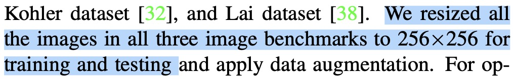

# PSNR_by_resize
A huge "breakthrough" in image restoration by resizing the ground truth.

### Introduction
Recently, some work claims that they beat all the previous image restoration methods, by a big margin (over 5. dB).
However, this huge "breakthrough" was mainly accomplished by resizing the ground truth image and calculate the PSNR on it, e.g.:




This repo demonstrates the "PSNR by resizing" is inappropriate, otherwise, I can claim that: **this repo achieves over 115 dB on GoPro dataset, exceeds the previous SOTA 80 dB**.

### Results on GoPro by resizing the ground truth


| PSNR (dB) | Resize (H, W) |
| :----------------------------------- | :------ |
| 33.71| (720, 1280)|
| **38.91**| (256, 256)|
| 43.22| (128, 128)|
| 47.89| (64, 64)|
| 51.73| (32, 32)|
| 54.20| (16, 16)|
| 55.94| (8, 8)|
| 58.46| (4, 4)|
| 115.06| (1, 1)|


### Process

1. download the [predicted results](https://pan.baidu.com/s/1LdjRwLcWVjgwCFwTJ96wiw?pwd=f7p3), and unzip it (in ./NAFNet-GoPro-width64-visual)
2. download the [ground truth](https://pan.baidu.com/s/1wPfPJANoUk5z8Dq99yTPCw?pwd=b66v), and unzip it (in ./GoPro-GT)
3. run ```python calc_resized_psnr.py```
    * [modify the size of comparison](https://github.com/mayorx/PSNR_by_resize/blob/main/calc_resized_psnr.py#L23-L24)


<details>
<summary>statistics</summary>


</details>
